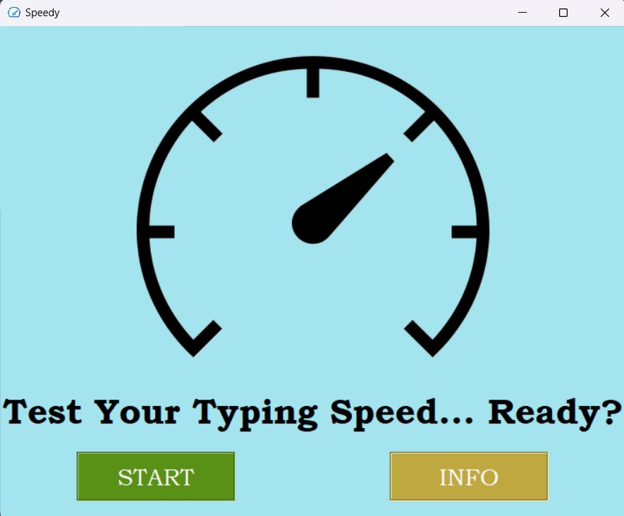
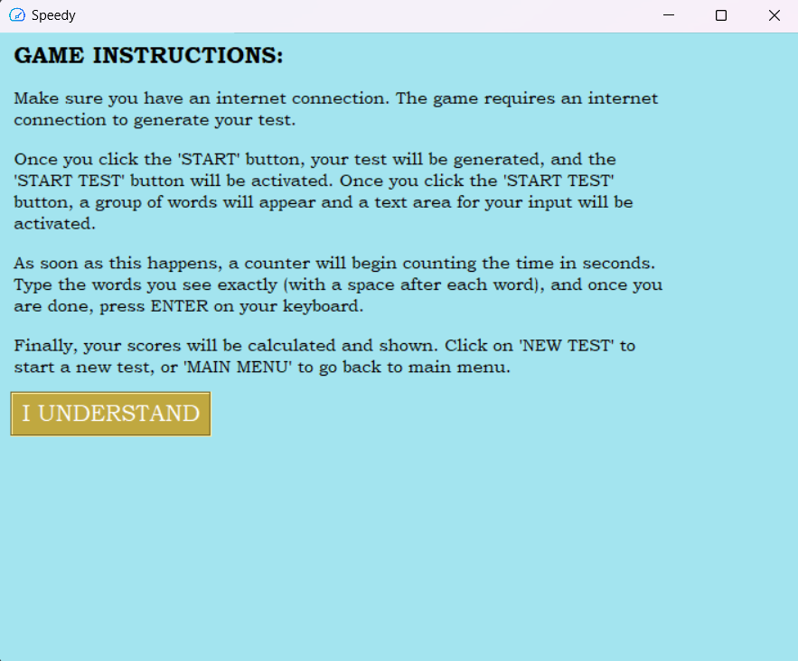
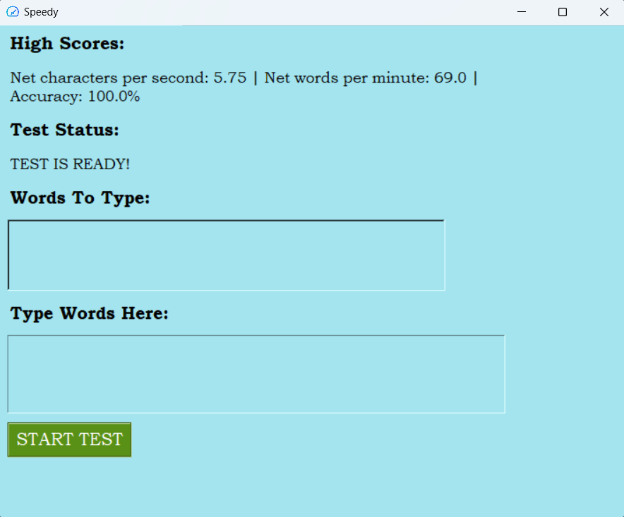
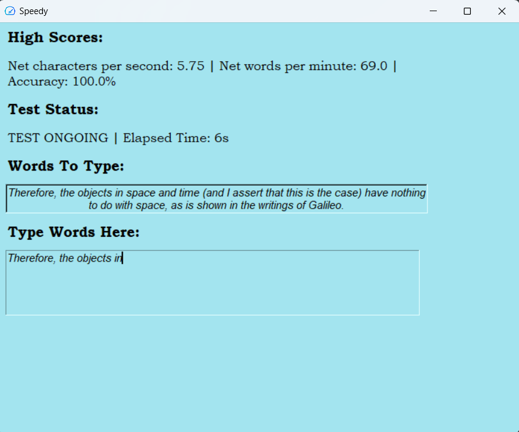
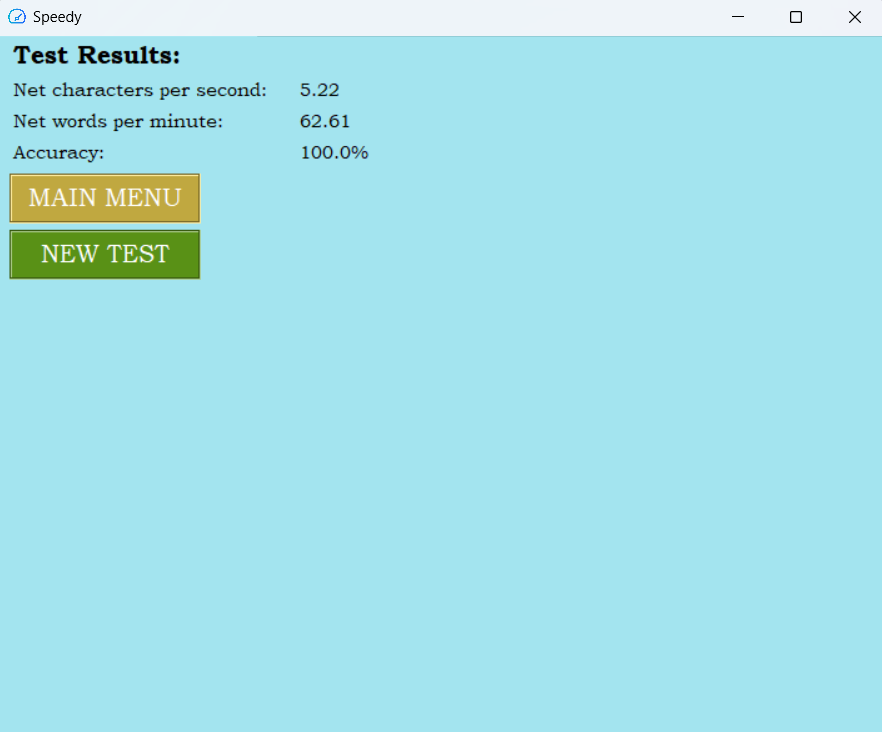

# Installation Instructions
To be able to use this app, run 'setup.py' once to install the required packages.

# Used Packages
1. Tkinter
2. Pillow
3. requests
4. BeautifulSoup
5. textdistance

# App Core Working Mechanism
To generate and score your typing speed tests, the app does the following.
1. The app goes to this url (https://fungenerators.com/random/text/sentence).
2. BeautifulSoup is used to scrape the random sentence generated in the home page.
3. A Tkinter Text widget is used to obtain the user's typed text.
4. A timer begins calculating the elapsed time from the beginning of the test till the end.
5. The test ends as soon as the user presses the ENTER/RETURN key.
6. The textdistance package is used to calculate the **levenshtein distance** between the test sentence and the user-typed sentence.
7. Standard calculations (i.e. Net words per minute, net characters per second, and accuracy) are calculated.
8. Finally, a test results screen is displayed with the option to either start a new test or go back to main menu.
9. Highscores are saved in a file called 'highscores.txt'.

# Why the Levenshtein distance?
This is simply a more reasonable and accurate way of calculating errors. To get a better idea, look at the example below, where classic correction is compared against correction with the levenshtein distance.

Say this is the test word: _Play_

And this is the user word: _Pwerlay_

Classic correction will just crudely move character by character and for each mismatch will count an error. Based on this approach, the number of mistakes the user has would be 6!!

Levenshtein distance, on the other hand, reasonably takes into account the fact that the only error here is the insertion of 3 extra characters "wer" and would therefore calculate the error count as 3 only, which is more reasonable and accurate.

I hope this makes sense :)

# App Screenshots

Home Screen:

Info Screen:

Test Screen (before beginning):

Test Screen (after beginning):

Test Results Screen:

To support me, go here:
https://www.paypal.me/codingdromar

Have fun :)

